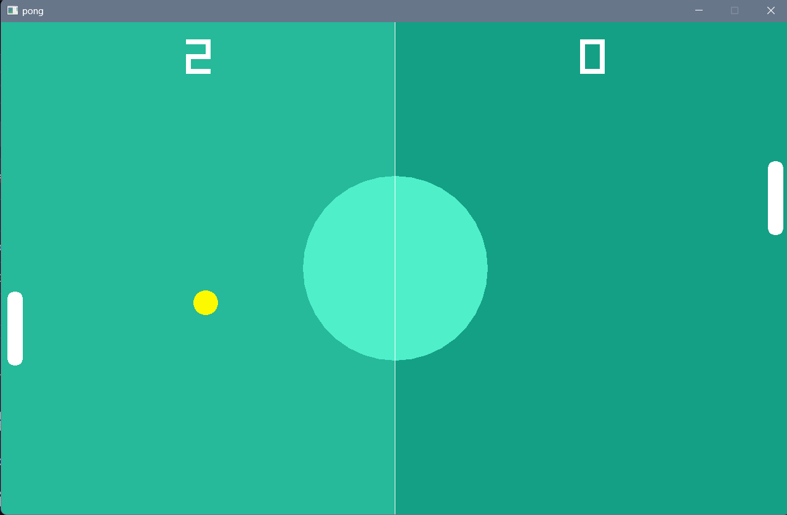

# pong

Basic pong game made to learn some Raylib. Written while following
[this tutorial](https://www.youtube.com/watch?v=VLJlTaFvHo4).



## Running

This has only been tested on Windows and Arch Linux, but should also work on other
platforms. However, the build scripts written with just only work on Windows.

Make sure [just](https://www.github.com/casey/just) and Odin are installed.

Then clone and run using:

```bash
git clone https://github.com/pes18fan/pong.git
cd pong
just
```

If you don't have just or are not on Windows, then run it straight from Odin:

```bash
odin run pong/ # From the repo's root dir
```
